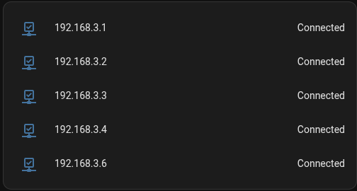

# Aufgabenblatt 06

In diesem Blatt geht es darum Webanwendung zu installieren und dabei eine Datenbank eines anderen Teams zu nutzen. Wir haben uns für die Smart Home Webanwendung Homeassistant entschieden welche auf unserer VM 5 (VM 5 `198.162.3.5`)  mit der Datenbank des Teams 04 läuft.

## Teilaufgaben

### 1) Installation und einrichten von Docker

#### 1.1) Konfiguaration von Nixos

Hierfür haben wir uns zunächst eine neue VM erstellt mit den empfohlenen Ressourcen (2 CPUs, 2GB RAM, 32GB Speicher). Wir haben uns gegen HomeassistantOS entschieden und lassen stattdesen Homeassistant in einem Docker Container auf Nixos laufen. Dadurch stehen in Homeassistant zwar leider keine Addons zur Verfügung, aber können wir weiterhin Nixos nutzen ;D
Dafür haben wir zunächst das `docker-compose` pkg zur `configuration.nix` hinzugefügt und dann eine neue nixos-config `homeassistant-config.nix` erstellt und in der `configuration.nix` importiert.

```shell
# homeassistant-config.nix
{ config, lib, pkgs, ... }:
{
    virtualisation.docker.enable = true;
    users.extraGroups.docker.members = [ "root" ];
}
```

Hiernach ist Docker fertig zur Verfügung und wir können das homeassistant image von dockerhub pullen dafür müssen wir aber zuvor noch in der Firewall vom der router-vm (VM 3) die IPs von `https://registry-1.docker.io` freigeben und können dabei auch gleich in der Firewall die Ports für homeassistant freigeben:

```nix
# router-network.nix 
...
firewall.extraCommands = ''
    ...
    iptables -A OUTPUT -d 54.227.20.253 -j ACCEPT
    iptables -A OUTPUT -d 54.236.113.205 -j ACCEPT
    iptables -A OUTPUT -d 54.198.86.24 -j ACCEPT

    # Allow: homeassistant
    iptables -A INPUT -p tcp --dport 8123 -j ACCEPT
    iptables -A OUTPUT -p tcp --sport 8123 -j ACCEPT
    ...
```

#### 1.2) Konfiguaration von Docker

Nun können wir das homeassistant image pullen:

```shell
docker pull homeassistant/home-assistant
```

Und ein config file für den docker container erstellen:

```yml
# compose.yml
services:
  homeassistant:
    container_name: homeassistant
    image: "ghcr.io/home-assistant/home-assistant:stable"
    volumes:
      - /root/homeassistant_config:/config
      - /etc/localtime:/etc/localtime:ro
      - /run/dbus:/run/dbus:ro
    restart: unless-stopped
    privileged: true
    network_mode: host

  cadvisor:
    container_name: cadvisor
    image: google/cadvisor:latest
    volumes:
      - /:/rootfs:ro
      - /var/run:/var/run:rw
      - /sys:/sys:ro
      - /var/lib/docker/:/var/lib/docker:ro
      - /dev/disk/:/dev/disk:ro
    ports:
      - "8080:8080"
    restart: unless-stopped
    devices:
      - /dev/kmsg
```

Hierbei ist zu beachten das wir vorm starten des containers noch das Verzeichnis `/home/root/homeassistant_config` erstellen müssen.
Darauf kann der Container gestartet werden:

```shell
docker compose up -d
```

#### 1.3) Konfiguaration von VirtualBox

Um homeassistant auch erreichen zu können müssen wir noch in VirtualBox eine Portweiterleitung einrichten:

```shell
VBoxManage modifyvm "vmpsateam03-05" --nat-pf1 "homeassistant,tcp,,60351,,8123"
```

Nun sollte Homeassistant unter [http://131.159.74.56:60351](http://131.159.74.56:60351) erreichbar sein.

#### 1.4) Einrichten des SSL Zertifikats & https

Da man bei Verbingung per `psa.in.tum.de:60351/` immer auf `https` umgeleitet wird, müssen wir ein SSL-Zertifikat einrichten, um dies zu ermöglichen.
Hierfür müssen wir `openssl` in die NixOS Konfiguration einfügen um dann ein Zertifikat zu generieren. Dieses legen wir unter `/root/homeassistant_config` ab, sodass HomeAssistant Zugriff darauf hat.

```shell
cd /root/homeassistant_config;
openssl req -sha256 -addext "subjectAltName = IP:192.168.3.5" -newkey rsa:4096 -nodes -keyout privkey.pem -x509 -days 730 -out fullchain.pem
# und danach alle Prompts für Country Code, Mail, ... ausfüllen
```

Dieses Zertifikat können wir in die `/root/homeassistant_config/configuration.yaml` für HomeAssistant eintragen:

```yaml
...
# add https certificate
http:
  ssl_certificate: /config/fullchain.pem
  ssl_key: /config/privkey.pem
```

Nach einem Neustart von HomeAssistant (Docker)...

```shell
docker container restart homeassistant
```

...ist HomeAssistant wie gefordert unter [https://psa.in.tum.de:60351/](https://psa.in.tum.de:60351/) erreichbar. ACHTUNG der jeweilige Browser muss das Zertifikat akzeptieren, da es sich um ein selbst signiertes Zertifikat handelt (`chromium-browser --ignore-certificate-errors`)

### 2) Einrichten von Homeassistant

#### 2.1) Konfiguaration der Datenbank

Nachdem wir Homeassistant erfolgreich installiert haben, können wir uns nun an die Konfiguration machen. Dafür müssen wir zunächst ein Admin-Konto erstellen und uns einloggen. Anschließend können wir die Datenbank des Teams 04 hinzufügen. Dafür müssen wir in der `configuration.yaml` folgende Zeilen hinzufügen:

```yaml
recorder:
  purge_keep_days: 30
  db_url: mysql://team3:<passwd>@192.168.4.5/databaseTeam3
```

([Quelle](https://kevinfronczak.com/blog/mysql-with-homeassistant))

#### 2.2) Konfiguaration der User

Zusätzlich müssen wir noch für alle Praktikums Teilnehmer:inen ein User Account erstellen:

settings -> People -> add Person -> <name> und "allow login" -> set passwd -> create

##### Passwörter

- Administratoren:

  | Nutzer   | Passwort                                  |
  | -------  | ----------------------------------------- |
  | ge78zig  | /home/ge78zig/homeassistant_password.txt  |
  | ge96xok  | /home/ge96xok/homeassistant_password.txt  |
  | sysAdmin | /home/root/README.md                      |

- Reguläre Nutzer:

  | Nutzer  | Passwort                                   |
  | ------- | ------------------------------------------ |
  | ge95vir | /home/ge95vir/homeassistant_password.txt   |
  | ge43fim | /home/ge43fim/homeassistant_password.txt   |
  | ge78nes | /home/ge78nes/homeassistant_password.txt   |
  | ge96hoj | /home/ge96hoj/homeassistant_password.txt   |
  | ge87yen | /home/ge87yen/homeassistant_password.txt   |
  | ge47sof | /home/ge47sof/homeassistant_password.txt   |
  | ge47kut | /home/ge47kut/homeassistant_password.txt   |
  | ge87liq | /home/ge87liq/homeassistant_password.txt   |
  | ge59pib | /home/ge59pib/homeassistant_password.txt   |
  | ge65peq | /home/ge65peq/homeassistant_password.txt   |
  | ge63gut | /home/ge63gut/homeassistant_password.txt   |
  | ge64baw | /home/ge64baw/homeassistant_password.txt   |
  | ge84zoj | /home/ge84zoj/homeassistant_password.txt   |
  | ge94bob | /home/ge94bob/homeassistant_password.txt   |
  | ge87huk | /home/ge87huk/homeassistant_password.txt   |
  | ge64wug | /home/ge64wug/homeassistant_password.txt   |
  | ge65hog | /home/ge65hog/homeassistant_password.txt   |
  | ge38hoy | /home/ge38hoy/homeassistant_password.txt   |

#### 2.3) Konfiguration eines Beispiels

Da homeassistant nun fertig eingerichtet ist, richten wir nun noch ein kleines Beispiel ein, um zu zeigen, wie generell in Homeassistant neue Geräte wie Sensoren oder Lichter hinzugefügt werden können. Da wir leider keine echten Geräte haben, haben wir uns für ein Beispiel für ein virtuelles Gerät entschieden, nämlich `Ping`, welches, wie der name schon sagt, den Status eines Netzwerkgeräts überprüft.

Hierfür muss man lediglich in die `Settings` gehen und unter `Integrations` das `Ping` Gerät hinzufügen. Hier kann man die IP-Adresse des Netzwerkgeräts angeben, das überwacht werden soll, und dann die Konfiguration abschließen, um das Gerät hinzuzufügen.

Dies haben wir für alle unsere bisherigen VMs gemacht und können nun den Status der VMs überwachen:


### 3) Testen

Das grundlegende Test-Setup bleibt identisch zu den vorherigen Wochen (siehe Blatt03).
Das Skipt kann sowohl auf der Host-VM, als auch auf jeder andern VM mit Verbingung zur Host-VM ausgeführt werden und ändert die zu laufenden Tests automatisch für die jeweilige VM.

1. *Host VM*
  Auf der Host-VM können wir prüfen, ob docker installiert ist...

  ```bash
  # test_PSA_06.sh
  start_test "check docker installed"
  if command -v docker 2>&1 >/dev/null; then
    print_success "docker installed"
  else
    print_failed "docker could not be found"
  fi
  ```

  ...die Docker Konfiguration existiert (then else Körper bleibt bis auf die Nachrichten bei allen weiteren Tests gleich und wird deshalb nicht weiter aufgeführt)...

  ```bash
  # test_PSA_06.sh
  start_test "check docker config exists"
  if [ -f /root/compose.yml ]; then
  ...
  ```

  ...und ob docker läuft:

  ```bash
    # test_PSA_06.sh
  start_test "check docker running"
  container_name="homeassistant"
  if [ "$( docker container inspect -f '{{.State.Status}}' $container_name )" = "running" ]; then
  ...
  ```

2. *Host & Andere VMs*
  Mit `curl` können wir unabhängig von der VM testen, ob Home Assistant erreichbar ist:

  ```bash
  # test_PSA_06.sh
  start_test "check home assistant reachable (curl)"
  status=$(curl --insecure -X GET -o - -I https://131.159.74.56:60351/ | head -n 1)
  if [[ $status =~ "200" ]]; then
  ...
  ```
